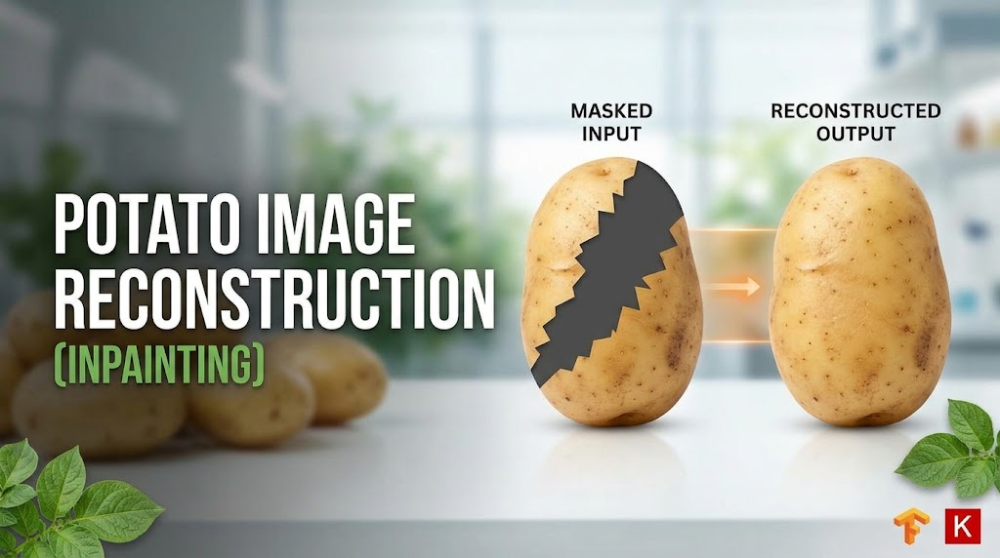
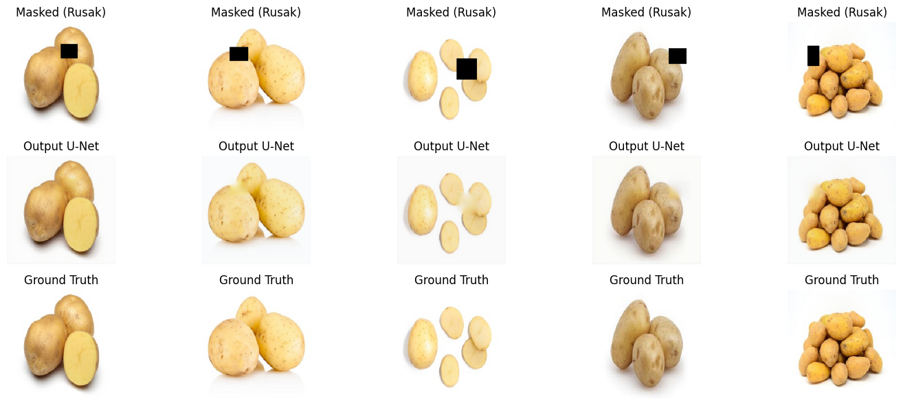

<div align="center">

<!-- Ganti URL ini dengan URL Banner/Logo proyek Anda -->

# 🥔 Potato Image Reconstruction (Inpainting) 🎨

[](#)
[](#)
[](#)
[](#)

*Proyek Deep Learning untuk memulihkan dan merekonstruksi bagian yang hilang pada citra kentang menggunakan arsitektur U-Net Autoencoder.*

</div>

---

## 🎯 Demo Hasil (Inpainting Results)

Berikut adalah performa model dalam merekonstruksi gambar kentang yang telah dipotong (*masked*) secara acak:

<div align="center">
  
</div>

*(Opsional: Jika Anda memiliki proses GIF dari epoch awal hingga akhir, Anda bisa menampilkannya di sini)*
<!--  -->

---

## 🧠 Arsitektur & Metodologi

Proyek ini memanfaatkan **U-Net Autoencoder** yang dimodifikasi. Model menerima gambar yang rusak dan belajar memprediksi piksel yang hilang dengan memahami konteks dari area di sekitarnya.

<div align="center">
  
  <br>
  <i>Ilustrasi Arsitektur U-Net (Encoder-Decoder dengan Skip Connections)</i>
</div>

### ✨ Sorotan Fitur
- **Custom U-Net Architecture**: Menggunakan *Group Normalization* untuk menstabilkan pelatihan.
- **Dynamic Cutout Masking**: Augmentasi dinamis yang memotong 10%-20% area gambar secara acak saat *training*.
- **Hybrid Loss Function (SSIM + Weighted MAE)**: Memaksa model untuk menghasilkan tekstur kentang yang realistis (SSIM) sekaligus meminimalkan kesalahan piksel pada area spesifik yang rusak (Weighted MAE).

---

## 📊 Evaluasi Model

Kinerja model dipantau melalui kurva Loss dan metrik *Mean Absolute Error* (MAE) selama proses pelatihan.

<div align="center">
  
</div>

---

## 🗂️ Dataset

Dataset diunduh secara otomatis via `kagglehub` dari:
👉 **[mukaffimoin/potato-diseases-datasets](https://www.kaggle.com/datasets/mukaffimoin/potato-diseases-datasets)**

> Proyek ini berfokus secara eksklusif pada kelas **"Healthy Potatoes"** (80% untuk *training*, 20% untuk *validation*).

---

## 🚀 Panduan Eksekusi

1. Clone repositori ini atau buka langsung di **Google Colab**.
2. Pastikan pustaka yang dibutuhkan sudah terinstal:
   ```bash
   pip install tensorflow numpy matplotlib scikit-image kagglehub
   ```
